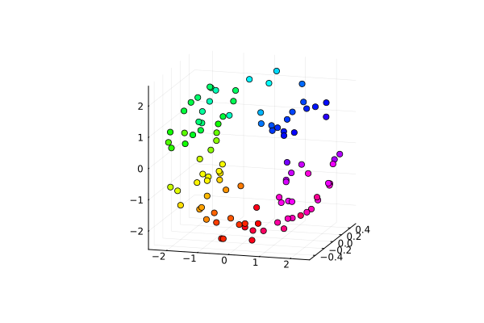
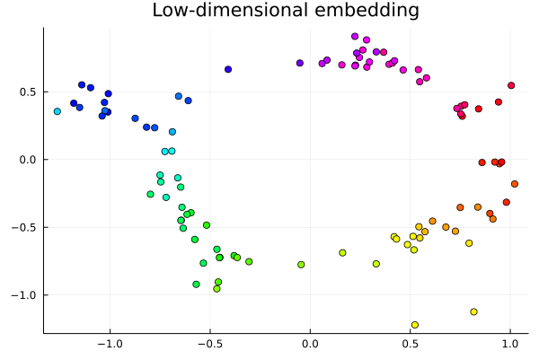
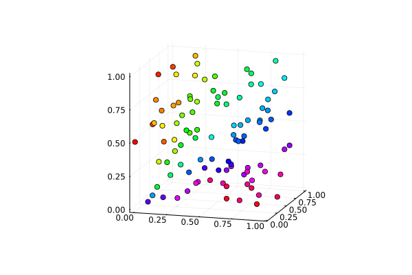
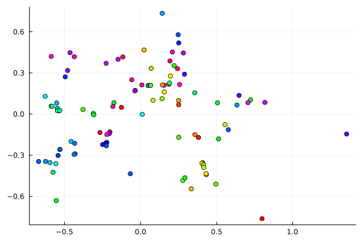

# UMAPCT.jl
Author: Luke Morris

This project implements the ISUMAP manifold learning algorithm. It is based off of the LUK4s-B/IsUMap reference implementation.

## Implementation details

So as not to distract from the high-level flow of this algorithm, popular Julia libraries are used for pre- and post-processing where possible.

The t-conorm used is the ["bounded sum"](https://en.wikipedia.org/wiki/T-norm#Examples_of_t-conorms).

## Results

### Torus

The torus is an intuitive test case. The phenomena of interest that we want to preserve are the hole in the center and the roughly circular outline.

  
  

### Uniformly random data

Uniformly random data are generated. Since it is highly un-structured, artifacts in the embedding shed light on the inherent bias of the algorithm itself.

  
  

